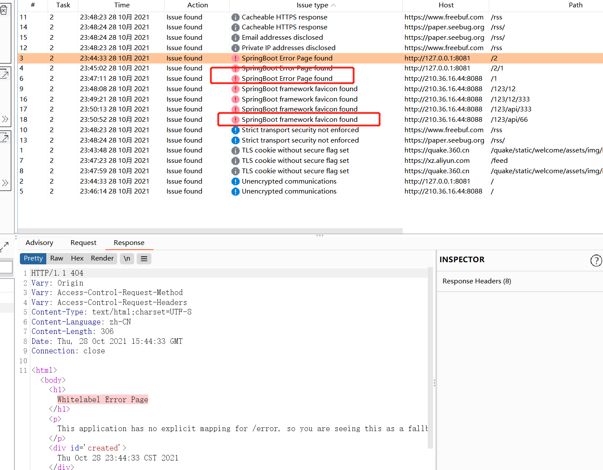

# SpringFinder 
***
## burp插件  递归遍历 urlpath 加favicon 图标 如果是绿色叶子图标则提示
如果404 页面有 "Whitelabel Error Page" 也会提示

效果如下图所示


缺点就是 同一个host 下如果请求了不通路径，都报错的话,会重复
***
原理就是 递归遍历urlpath 分别替换成favicon.ico 进行请求，然后获取响应体body 在求 散列值和shodan和fofa的算法一样

```java
    oResBodyInfo = ores.substring(oresponse.getBodyOffset());
                byte[] destResponse;
                destResponse = Arrays.copyOfRange(res, oresponse.getBodyOffset(), res.length);
                if (destResponse != null) {
                    if (isSpringBoot(destResponse)) {
                        issues.add(new CustomScanIssue(
                                baseRequestResponse.getHttpService(),
                                helpers.analyzeRequest(baseRequestResponse).getUrl(),
                                new IHttpRequestResponse[]{callbacks.applyMarkers(baseRequestResponse, null, null)},
                                "SpringBoot framework favicon found",
                                "The website favicon  is  springboot \n #you can check SpringBoot Vuln",
                                "High",
                                "Firm"));
                        return issues;
                    }
                }
```
求图标 散列值
```java
  // 判断响应包的图标是不是spring
    public boolean isSpringBoot(byte[] destResponse) {
        String base64Str = Base64.getMimeEncoder().encodeToString(destResponse);
        int favicon = Hashing.murmur3_32().hashString(base64Str.replace("\r", "") + "\n", StandardCharsets.UTF_8).asInt();
        if (116323821 == favicon) {
            return true;
        } else return false;
    }

```
